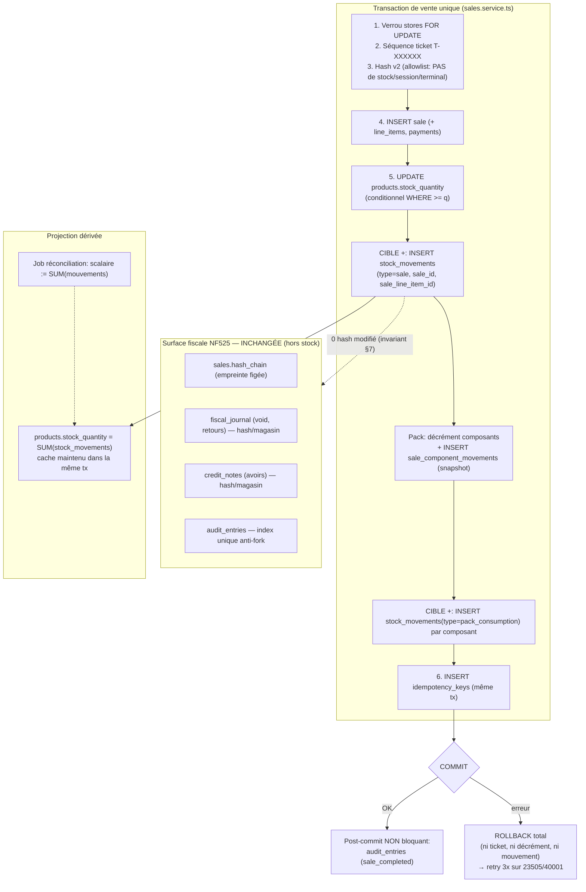

# Synthèse décisionnelle — Journal de stock unifié & surface fiscale NF525

> **Statut : PROPOSITION. AUCUN code, AUCUNE migration, AUCUN changement de
> comportement tant que l'owner n'a pas validé explicitement cette architecture.**
> Reprise de [`PRODUCTS_FISCAL_STOCK_ARCHITECTURE.md`](PRODUCTS_FISCAL_STOCK_ARCHITECTURE.md),
> vérifiée contre le code réel (références `fichier:ligne` du backend `packages/backend/src`).
> Objet : donner à l'owner les **décisions structurantes** à trancher avant tout GO.

**Correction vs v1 du document d'architecture** : le décrément de vente n'est plus
`GREATEST(0, stock - q)` mais un décrément **conditionnel** `… WHERE stock_quantity >= $1
RETURNING stock_quantity` (`sales.service.ts:833-840`). Le fond (garde anti-négatif,
race-safe) est identique ; la forme est corrigée ici.

---

## A. Les 11 décisions structurantes

Format par point : **Constat** (code réel) → **Décision proposée** → **À valider par l'owner**.

### 1. Source de vérité unique du stock

**Constat — deux systèmes parallèles qui peuvent diverger :**

| Système | Support | Écrit aujourd'hui par | Portée |
|---|---|---|---|
| **A — scalaire** | `products.stock_quantity` | vente (`sales.service.ts:833`), retour (`returns.service.ts:257`), void (`sales.service.ts:1501`), `stock.adjustStock`, inventaire, sync `/sales` | stock « vendable » lu par la caisse, **par magasin** (`store_id`) |
| **B — journal + soldes** | `stock_movements` + `stock_balances` | **uniquement** `stock-locations.service.ts` (réception, transfert, dispatch, pertes) | entrepôt, **par emplacement** (`location_id`) |

`stock_movements` se décrit comme « immutable journal… every qty change is a movement »
(`stock-movement.entity.ts:8-11`) mais **aucune vente / retour / annulation / void ne l'écrit** :
le type `sale` existe dans l'enum et n'est jamais émis. Les deux systèmes peuvent diverger
(diagnostic lecture seule `findStockDivergences`, `GET /stock-locations/divergences`).

**Décision proposée :** `stock_movements` devient la **source unique de vérité** de TOUT
mouvement (réception, transfert, perte, **vente, retour, ajustement, void, consommation de pack**).
`products.stock_quantity` devient un **cache dérivé** (projection = solde courant), maintenu
dans la **même transaction** que le mouvement, jamais écrit « à la main ». Invariant :
`stock_quantity == SUM(mouvements du produit pour ce magasin)`.

**À valider :**
- (a) **Modèle d'emplacement pour les ventes.** `stock_movements` raisonne en `from/to_location_id` ;
  les ventes raisonnent en `store_id` scalaire. **Décision requise** : soit on ajoute `store_id`
  sur `stock_movements` et un mouvement de vente est `store_id + from_location_id NULL` (recommandé,
  minimal, cohérent avec `sale_component_movements` qui porte déjà `store_id`) ; soit on rattache
  chaque magasin à une `stock_locations` de type `store` et la vente sort de cet emplacement
  (plus « propre » multi-emplacement mais impose un back-mapping magasin→emplacement).
- (b) Maintien de la projection : **service transactionnel** (Option 1, recommandée) et non trigger DB.

### 2. Mouvement créé lors d'une vente / retour / annulation / void

**Constat + Décision par opération :**

| Opération | Aujourd'hui | Cible (mouvement ajouté) |
|---|---|---|
| Vente ligne simple | `UPDATE products … WHERE stock_quantity>=q RETURNING` (`sales.service.ts:833`) | **+ INSERT** `stock_movements(type='sale', sale_id, sale_line_item_id, product_id, qty)` même tx |
| Vente pack | décrément composants + snapshot `sale_component_movements` (`:858-897`) | **+ INSERT** `stock_movements(type='pack_consumption')` par composant |
| Retour (avoir) | restaure scalaire + composants depuis snapshot (`returns.service.ts:257,273`) | **+ INSERT** `stock_movements(type='return_customer')` (parent + composants) |
| **Annulation = `voidSale`** | `UPDATE … stock_quantity + qty` **parents seuls** (`sales.service.ts:1501`) — **bug G3** | **+ INSERT** mouvement inverse `type='void'` **parent ET composants** (relire snapshot) |
| Ajustement inventaire | `UPDATE` scalaire + audit (`stock.adjustStock`) | **+ INSERT** `stock_movements(type='inventory_adjust', reason obligatoire)` |
| Réception / transfert / perte | déjà journalisé (système B) | **inchangé** |

> **Terminologie « annulation » vs « void ».** Dans ce code il n'existe **pas** d'annulation
> séparée d'une vente validée : une vente validée ne peut être défaite que par (i) `voidSale`
> — réservé aux ventes **sans espèces réalisées** (`sales.service.ts:1469-1483`, sinon
> `ConflictException` → chemin retour/avoir obligatoire), ou (ii) un **retour/avoir**
> (`createReturn`). Il n'y a pas de « cancel avant validation » côté serveur.

**Décision structurante :** toute correction s'écrit par **mouvement inverse append-only**
(void = mouvement de sens opposé ; retour = `return_customer`), **jamais** par effacement ou
UPDATE du mouvement d'origine — symétrie exacte du modèle fiscal (§6).

**À valider :** le **fix G3** (void restitue les composants de pack) est un **changement de
comportement** de sortie de stock pour les packs annulés → il exige son **propre GO** et un
test rouge→vert dédié (bloc F2).

### 3. Gestion des packs et de leurs composants

**Constat :** deux tables complémentaires, déjà correctes :
- `product_components` (`product-component.entity.ts`) — composition **courante, modifiable** :
  `store_id, parent_product_id, component_product_id, quantity_per_parent, is_active` ; unicité
  `(store_id, parent, composant)`, garde anti-boucle BFS, `quantity_per_parent > 0`.
- `sale_component_movements` (`sale-component-movement.entity.ts`) — **snapshot FIGÉ** par
  (ligne de vente × composant), **append-only**, hors hash : `store_id, sale_id, sale_line_item_id,
  parent_product_id, component_product_id, quantity_per_parent, quantity_consumed, employee_id,
  session_id, terminal_id, created_at`.

La vente d'un pack : le parent reste **la seule ligne commerciale** (tout le CA / une ligne ticket),
les composants sortent du stock (`quantity_per_parent × qty`) et le snapshot fige la composition.
Le retour recrédite **depuis le snapshot** (`returns.service.ts:273-295`), donc résiste à une
modification ultérieure de `product_components`.

**Décision proposée :** **conserver ce modèle** (snapshot = source de restitution, déjà juste).
Ajouter les mouvements `pack_consumption` (vente) et leurs inverses `void`/`return_customer`
au journal unifié, **dérivés du snapshot** (jamais de `product_components`). Le fix G3 réutilise
exactement le snapshot que `createReturn` lit déjà.

**À valider :** aucun changement de modèle pack ; seul l'ajout journal + fix void.

### 4. Idempotence et prévention du double décrément

**Constat — robuste sur le chemin `/sales` :**
- Clé **fournie par le client** (`Idempotency-Key`, `sales.controller.ts:31`), pas dérivée serveur.
- **Replay avant validation stock** (`sales.service.ts:381-388`) → renvoie la réponse en cache,
  ne ré-entre jamais dans la transaction.
- **Re-check en transaction** (`:677-685`) pour les doublons concurrents.
- Clé persistée **dans la même tx** que la vente (`:930-939`), PK unique → collision `23505`
  interceptée par la boucle `MAX_RETRIES=3` (`:668`). TTL 7 jours.
- Le module `/sync/push` déduplique par **`id` de vente seulement** (`sync.service.ts:99-116`,
  plus faible) **mais n'est pas utilisé** pour les ventes offline (voir §8).

**Décision proposée :** le nouvel INSERT `stock_movements` étant **dans la même transaction
idempotente que la vente**, il hérite de l'idempotence : un replay renvoie le cache et n'écrit
aucun 2ᵉ mouvement. **Défense en profondeur** : contrainte d'**unicité partielle**
`(sale_line_item_id, product_id, movement_type) WHERE sale_id IS NOT NULL` → même en cas de rejeu
anormal, un seul mouvement par (ligne, produit, type). Idem pour void (`type='void'` distinct du
`type='sale'`).

**À valider :** composition exacte de la clé d'idempotence du mouvement (proposée ci-dessus) ;
confirmer qu'aucun `client_entry_id` supplémentaire n'est requis sur `sales` (l'idempotence vit
déjà dans `idempotency_keys`, il n'y a pas de colonne `client_entry_id` sur `sales`).

### 5. Lien vente ↔ session ↔ magasin ↔ terminal ↔ employé ↔ produit

**Constat — colonnes réelles sur `sales` (`sale.entity.ts`) :**

| Lien | Colonne | Type / nullable | Source | Dans le hash ? |
|---|---|---|---|---|
| Magasin | `store_id` | non null | JWT, imposé par `TenantInterceptor` (`main.ts:291`) | **oui** (allowlist) |
| Employé (caissier) | `employee_id` | non null | JWT (`sales.service.ts:751`) — **pas** de `cashier_id` | **oui** |
| Session caisse | `session_id` | uuid **nullable** | résolu serveur depuis la session active du terminal, **seulement si** `session.employeeId === employeeId` (`:175-181`), sinon `null` | **non** (hors empreinte) |
| Terminal | `terminal_id` | varchar **nullable** | en-tête `X-Terminal-Id` (texte libre) | **non** |
| Produit | via `sale_line_items.product_id` | — | lignes de vente | items dans le hash |

**Trois notions distinctes de « terminal »** — à ne pas confondre : (a) `X-Terminal-Id` (chaîne
libre, ce que portent `sales.terminal_id` et `pos_sessions.terminal_id`) ; (b) `payment_terminals`
(lecteurs Stripe, FK magasin) ; (c) `pos_machines` (enrôlement, migration 1756, FK magasin).
**Seul (a)** relie vente/session ; (b) et (c) ne sont **pas** liés par FK à `sales.terminal_id`.

**Une vente n'exige PAS de session ouverte** : `session_id` nullable, legitimement `null`
(offline, mauvais employé sur le terminal, legacy). Le seul verrou à la création est l'enrôlement
machine (`assertMachineEnrolled`, `:132-157`) et seulement si `stores.enrollment_enforced=true`.

**Décision proposée :** le mouvement de vente porte la **même provenance déjà disponible**, calquée
sur `sale_component_movements` : `store_id` (dénormalisé, nécessaire au scope multi-tenant),
`employee_id` (déjà natif au journal), `sale_id`, `sale_line_item_id`. `session_id` / `terminal_id`
restent **joignables via la vente** et **non fiscaux** — on ne les rend pas obligatoires sur le
mouvement (cohérence avec leur statut nullable/hors-hash).

**À valider :** dénormaliser ou non `session_id`/`terminal_id` sur `stock_movements` (confort de
requête vs redondance). Recommandation : non — jointure via `sale_id`.

### 6. Journal append-only et corrections par contre-écriture

**Constat — trois chaînes append-only déjà en place, sans trigger DB :**
- **Hash de vente** (fiscal, par magasin) : `sales.hash_chain_prev/current`, v2, allowlist §7.
- **`fiscal_journal`** (par magasin) : scelle void + retours ; `payload` texte verbatim,
  `hash_chain_current = sha256(prev + payload)`, vérifieur `FiscalVerifyService.verifyJournal`
  (**recompute autoritaire**, `fiscal-verify.service.ts:210-230`).
- **`audit_entries`** (par magasin) : v1/v2, index **unique anti-fork** `(store_id, previous_hash)`
  (`1744000000000-HardenAuditChain.ts`).

Append-only = **doctrine + vérifieur (+ index unique pour l'audit)** ; **aucun trigger/RULE** dans
aucune migration (choix assumé du dépôt). Corrections = **contre-écritures** : le void écrit un
événement `void` chaîné dans `fiscal_journal` (`sales.service.ts:1538-1570`), le retour écrit
3–4 maillons (`returns.service.ts:324-379`).

**Décision proposée :** `stock_movements` **reste strictement append-only** — jamais d'UPDATE/DELETE
d'un mouvement. Corrections = **mouvements inverses** (void, `inventory_adjust` avec `reason`), même
doctrine que la surface fiscale. On **conserve la cohérence « pas de trigger »** (doctrine + contrainte
d'unicité d'idempotence + vérifieur de solde `SUM(mouvements)=scalaire`).

**À valider :** garder « pas de trigger » (cohérent) vs ajouter une garde DB anti-UPDATE/DELETE
(diverge de la doctrine actuelle). Recommandation : pas de trigger.

### 7. Articulation exacte avec le journal fiscal NF525 existant

**Constat — le stock est DÉLIBÉRÉMENT hors de l'empreinte fiscale.** Allowlist du hash de vente
(`sales.service.ts:727-744`) : `v, ticketNumber, storeId, employeeId, customerId, subtotal,
discountTotal, taxTotal, totalAfterDiscount, payments[{method,amount}], completedAt,
items[{ean,qty,total}]`. `session_id`, `terminal_id` et **toute quantité de stock** en sont
exclus (posés après le calcul du hash, `:772-774`).

**Décision structurante (INVARIANT NON NÉGOCIABLE) :** le journal de stock est **auxiliaire, non
fiscal**. Il **n'entre dans AUCUN hash** (vente, `fiscal_journal`, `credit_notes`, `audit`).
Ajouter des mouvements de stock modifie **zéro hash existant** — à **prouver** par un test de
non-régression « hash identique avant/après ». Le journal de stock **ne remplace ni** le ticket,
**ni** la chaîne d'avoirs, **ni** le Z-report.

**Règle d'ordonnancement critique (anti-trou de séquence) :** l'INSERT stock se fait **avant COMMIT,
dans la même transaction** que la vente déjà hashée/ticketée. Donc soit tout est validé
(ticket + mouvement), soit rien (aucun trou de séquence de ticket). Un échec d'écriture du journal
de stock ne doit **jamais** laisser une vente hashée committée sans mouvement, ni provoquer un trou.

**À valider :** référencer ou non l'`id` du mouvement de stock dans le payload `stock_restored`
du `fiscal_journal` (aujourd'hui il liste `productId/quantity`). Mineur, optionnel.

### 8. Comportement hors ligne et resynchronisation

**Constat — les ventes offline passent par `/sales`, pas par `/sync/push` :**
- Le POS rejoue chaque ticket offline via `POST /sales` avec l'`Idempotency-Key` **portée depuis
  la tentative d'origine** (`pos-desktop/.../syncEngine.ts:135,149`). Décrément serveur **une seule
  fois par clé** (§4).
- `session_id`/`terminal_id` = `null` pour un rejeu offline (auditable « session inconnue »).
- **Pull** (`GET /sync/pull`, `sync.service.ts:264-285`) renvoie les `products` modifiés depuis
  `lastSyncAt` avec le **`stockQuantity` autoritaire serveur** → le client écrase son stock local.
  Le décrément de vente pose `updated_at = NOW()` (`:836`) donc le produit ressort au prochain pull.
- Le module `/sync/push` existe mais : dédup ventes par `id` seul, `stockAdjustments` sans appelant
  vivant, conflits clients = *server-wins* LWW, **signature HMAC non câblée** (`syncEngine.ts:100-108`),
  détection de conflit stock côté client = **TODO** non implémenté.

**Décision proposée :** conserver le rejeu offline sur `/sales + Idempotency-Key` (robuste). Le
nouveau mouvement s'écrit dans la même transaction idempotente → **un seul mouvement par clé**,
pas de double comptage même en rejeu. La réconciliation reste **pull autoritaire serveur**.

**Risque existant à préserver (pas nouveau) :** une vente « réussie » offline peut être **rejetée
au sync** si le stock serveur est épuisé entre-temps (la garde `>= q` prime sur l'optimisme offline).
Comportement actuel ; le journal unifié doit le **préserver à l'identique**.

**À valider :**
- (a) **Horodatage du mouvement offline.** `created_at` = temps serveur (sync) ≠ temps réel de la
  vente. **Décision** : ajouter ou non `occurred_at` (temps métier `completedAt`) sur le mouvement
  pour une chronologie de stock correcte sur les fenêtres offline. Recommandation : oui (`occurred_at`
  nullable, temps métier ; `created_at` reste le temps d'enregistrement).
- (b) Les faiblesses de `/sync/push` (dédup par id, HMAC non câblé) sont **préexistantes et hors
  périmètre** de ce chantier — signalées, non corrigées ici.

### 9. Règles de reprise sur erreur / crash

**Constat :** vente = **une transaction** avec `startTransaction`→`commit` (`:672`→`:942`),
rollback+release sur erreur (`:1098-1121`), boucle 3× sur `23505/40001`. Replay idempotent
(fast-path + re-check en tx) absorbe un retry client après crash. `fiscal_journal`/`credit_notes`
se sérialisent via `SELECT … FOR UPDATE` sur `stores` ; `audit_entries` via mutex in-process +
index unique. L'audit est **post-commit non bloquant** (échec → alerte `AUDIT_WRITE_FAILED`, pas
de rollback de vente).

**Décision proposée :**
- Le mouvement de stock est **dans la tx de vente** : crash **avant** commit → tout est annulé
  (ni ticket, ni décrément, ni mouvement) ; crash **après** commit → mouvement durable. Aucun état
  intermédiaire « vente sans mouvement ».
- Reprise = le client rejoue avec **la même `Idempotency-Key`** → chemin replay (réponse en cache),
  **aucun 2ᵉ mouvement**.
- Le cache `stock_quantity`, maintenu **dans la même tx**, ne peut pas dériver sur crash. Un **job
  de réconciliation** (extension de `findStockDivergences`) détecte/répare toute dérive résiduelle
  (chemins legacy) en recalculant `scalaire = SUM(mouvements)` — **les mouvements font foi**.

**À valider :** existence + périodicité + autorité du job de réconciliation (mouvements gagnent) ;
maintien du caractère non bloquant de l'audit post-commit (inchangé).

### 10. Stratégie de migration des données existantes

**Constat :** les ventes/retours/voids **historiques n'ont aucun `stock_movements`** (le journal B
n'a jamais connu les ventes). Un simple ajout de colonnes (F0) ne « remplit » pas l'historique.

**Décision proposée — cutover par solde d'ouverture, PAS de réécriture d'historique fiscal :**
- Au basculement, écrire **un** mouvement `opening_balance` (ou `inventory_adjust` motivé) par produit
  (et par magasin/emplacement) = `products.stock_quantity` **courant**, de sorte que
  `SUM(mouvements) == scalaire` **dès J0**. Puis toute vente/retour/void nouvelle s'ajoute.
- **Option lecture seule** (facultative, pour le reporting) : générer a posteriori des mouvements
  historiques dérivés de `sale_line_items` + `sale_component_movements` + `credit_notes` — **sans
  jamais toucher** les chaînes fiscales (ces mouvements portent `sale_id` et sont purement auxiliaires).

**À valider :** **solde d'ouverture au cutover (recommandé, propre, réversible)** vs backfill
historique complet (exhaustif mais lourd et à cadrer). Recommandation : solde d'ouverture.

### 11. Risques de régression (ventes, remboursements, inventaires, clôtures)

| Domaine | Risque | Mitigation |
|---|---|---|
| **Ventes** | Un bug dans l'INSERT mouvement pourrait faire **rollback une vente** qui réussissait avant ; ou modifier le hash | Phase **shadow F1** (écriture double, lecture inchangée) → **0 changement de comportement** ; test « hash identique » ; garde `>= q` **préservée** |
| **Remboursements / avoirs** | Altérer le hash `credit_notes` ou les 3–4 maillons `fiscal_journal` | Mouvement `return_customer` **hors** payload d'avoir ; même tx ; allowlist avoir inchangée (`{code,storeId,originalSaleId,total,lines}`) |
| **Inventaires** | Si le scalaire devient dérivé, `adjustStock` doit écrire `inventory_adjust` ; la détection d'écart ≥20 % (`stock-variance`, décision 7) doit lire **la même** source | Convergence sur un seul chemin d'écriture ; fenêtre de double-run F1↔F3 avec comparaison `scalaire vs SUM` |
| **Clôtures (Z / session)** | Le Z-report est **gelé** ; la clôture de session dérive la caisse **espèces** serveur (`pos-session.service.ts:443-463`) | Le stock **n'entre pas** dans le Z ni dans la caisse de session → **impact nul** ; vérifier que les chemins cash de void/retour (qui touchent `cash_refunds_minor_units`) **restent inchangés** |
| **Void packs (fix G3)** | Le fix **change** la sortie de stock des packs annulés | Bloc **F2** gated, test rouge→vert dédié, **GO propre** |

---

## B. Diagramme de flux

Voir le diagramme rendu dans le fil (matrice « qui écrit quoi » actuel vs cible + chemin
d'écriture transactionnel unique + séparation fiscale). Version texte (Mermaid) ci-dessous.



---

## C. Inventaire exact — tables / colonnes / index / contraintes

### C.1 Table MODIFIÉE : `stock_movements` (bloc F0, additif + réversible)

**État actuel** (`stock-movement.entity.ts`, DDL `1735000000000-CreateStockLocations.ts:57-78`) :

```
stock_movements(
  id                uuid PK default uuid_generate_v4(),
  product_id        uuid NOT NULL REFERENCES products(id) ON DELETE CASCADE,
  movement_type     varchar(30) NOT NULL,
  from_location_id  uuid NULL REFERENCES stock_locations(id) ON DELETE SET NULL,
  to_location_id    uuid NULL REFERENCES stock_locations(id) ON DELETE SET NULL,
  quantity          integer NOT NULL,          -- toujours positif, sens via from/to
  reference         varchar(100) NULL,
  reason            varchar(500) NULL,
  note              varchar NULL,
  employee_id       varchar(100) NOT NULL,
  employee_name     varchar(200) NOT NULL,
  created_at        timestamp NOT NULL default now()
)
-- index existants:
idx_stock_movements_product_created (product_id, created_at)
idx_stock_movements_from (from_location_id)
idx_stock_movements_to   (to_location_id)
idx_stock_movements_type (movement_type)
idx_stock_movements_created (created_at)
```

**Ajouts proposés (F0)** — tous **nullable, sans défaut réécrivant, réversibles (`DROP`)** :

| Ajout | Définition | Rôle |
|---|---|---|
| colonne | `store_id uuid NULL` | scope multi-tenant du mouvement de vente (décision §1a) |
| colonne | `sale_id uuid NULL` | lien vente (jointure vers store/session/terminal) |
| colonne | `sale_line_item_id uuid NULL` | lien ligne de vente (granularité + idempotence) |
| colonne | `occurred_at timestamp NULL` | temps métier (offline) ≠ `created_at` (décision §8a) |
| index | `idx_stock_movements_sale (sale_id) WHERE sale_id IS NOT NULL` | requêtes par vente |
| index | `idx_stock_movements_store_created (store_id, created_at)` | historique magasin |
| contrainte | `UNIQUE (sale_line_item_id, product_id, movement_type) WHERE sale_id IS NOT NULL` | **idempotence** (un seul mvt par ligne×produit×type) |

**Valeurs logiques de `movement_type` ajoutées** (la colonne `varchar(30)` les accepte déjà ;
l'élargissement de l'union TypeScript est **du code, phase ultérieure**, pas F0) :
`sale`, `pack_consumption`, `return_customer`, `inventory_adjust`, `void`, `opening_balance`.

`down()` F0 = `DROP` des 4 colonnes + 2 index + 1 contrainte. **Aucune donnée détruite** (colonnes
vides), aucun impact sur l'existant.

### C.2 Table INCHANGÉE mais re-rôlée : `products`

`products.stock_quantity` : **aucune** modification de schéma. Change de **rôle** (source → cache
dérivé), sans DDL. `stock_balances` reste le solde par emplacement du système B.

### C.3 Tables fiscales — **ZÉRO DDL** (invariant §7)

`sales`, `sale_line_items`, `sale_component_movements`, `fiscal_journal`, `credit_notes`,
`credit_note_lines`, `audit_entries`, `product_components`, `pos_sessions` : **aucune colonne,
aucun index, aucune contrainte modifiés**. Le chantier n'y touche pas.

### C.4 Numérotation de migration

Dernière migration = `1766000000000` (Lot I catalogue). Le bloc F0 serait `1767000000000+`.
Chaîne additive/réversible, prouvée `up → down → re-run` sur vrai PG (gated), comme le catalogue.

---

## D. Inventaire exact — endpoints

### D.1 Endpoints au **comportement modifié** (signature/contrat **inchangés**)

| Endpoint | Fichier | Ajout de comportement |
|---|---|---|
| `POST /sales` | `sales.controller.ts:26` | + INSERT mouvement(s) `sale`/`pack_consumption` dans la tx |
| `POST /sales/:id/void` | `sales.controller.ts:101` | + mouvements inverses `void` **parent + composants** (fix G3) |
| `POST /returns` | `returns.controller.ts:26` | + INSERT `return_customer` (parent + composants) |
| `POST /returns/by-ticket` | `returns.controller.ts:45` | idem (même service) |
| `POST /stock/:productId/adjust` | `stock.controller.ts:45` | + INSERT `inventory_adjust` (reason obligatoire) |

### D.2 Endpoints **lecture seule** étendus (diagnostic / preuve)

| Endpoint | Fichier | Extension |
|---|---|---|
| `GET /stock-locations/movements/product/:productId` | `stock-locations.controller.ts:163` | inclure les mouvements `sale/return/void/adjust` |
| `GET /stock-locations/divergences` | `stock-locations.controller.ts:50` | comparaison `scalaire vs SUM(mouvements)` élargie aux ventes (shadow F1) |

### D.3 Endpoint **nouveau** (optionnel, admin, gated)

| Endpoint | Rôle | Décision |
|---|---|---|
| `POST /stock/reconcile` (admin) | recalcule `stock_quantity := SUM(mouvements)` par produit/magasin | à valider §9 (job vs endpoint) |

**Aucun nouvel endpoint d'écriture n'est requis** : tous les mouvements sont des **effets de bord**
d'endpoints existants (vente, void, retour, ajustement).

---

## E. Points de validation (checklist GO)

- [ ] **GO owner nommé** sur cette architecture.
- [ ] §1a **Modèle d'emplacement des ventes** : `store_id` sur mouvement (recommandé) vs emplacement `store`.
- [ ] §1b **Option 1 service transactionnel** (recommandé) vs trigger (rejeté).
- [ ] §2 **Fix G3** = changement de comportement (packs void) → **GO propre** + test rouge→vert.
- [ ] §4 **Clé d'idempotence du mouvement** = `(sale_line_item_id, product_id, movement_type)`.
- [ ] §6 **Pas de trigger DB** (cohérence doctrine) confirmé.
- [ ] §7 **Invariant stock hors hash** + test « hash identique avant/après ».
- [ ] §8a **`occurred_at`** (temps métier offline) : oui/non.
- [ ] §9 **Job de réconciliation** (mouvements font foi) : périodicité + autorité.
- [ ] §10 **Cutover par solde d'ouverture** (recommandé) vs backfill complet.
- [ ] Ordre des blocs **F0→F4**, chacun **feature-flaggé** et **gated séparément**.
- [ ] Preuve sur **vrai PG (gated)** pour F1/F2/F3, pas seulement pg-mem.

---

**Tant que cette architecture n'est pas validée explicitement par l'owner, aucun code n'est
écrit, aucune migration n'est générée et aucun comportement n'est modifié** sur : journal de
stock unifié, décrément de vente, `voidSale`, retours, ajustements, ou toute surface NF525.
